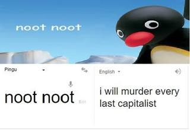

# Comrade Pingu

*You may be looking for the [other website](http://comradepingu.glitch.me).*

A fun Discord bot created on the 3rd of March 2019 with [discord.js](https://discord.js.org). Kill all the capitalist scum!

## [Status](https://stats.uptimerobot.com/49G6NHJB7W/782979270)
| Current | 24 Hours | 7 Days | 30 Days | Response |
| - | - | - | - | - |
|  |  |  |  |  |

## Inviting
To invite Comrade Pingu to your sever, you must have the Manage Server permission and then use [this link](https://discordapp.com/oauth2/authorize?client_id=554539674899841055&scope=bot&permissions=3271744).

## Prefix
Comrade Pingu’s default prefix is `.`.

## Documentation
| Command | Aliases | Description | Usage | Cooldown (s) |
| - | - | - | - | - |
| `help` | `commands`, `h` | Lists all my commands or gets info about a specific command. | `.help [command]` `command` (optional) The command that you want to get info about. If omitted, all the commands will be listed. | 5 |
| `info` | `in` | Gets info about me. | `.info` | 3 |
| `invite` | `add`, `inv`, `link` | Gets my invite link. | `.invite` | 3 |
| `iwmelc` | `iwillmurdereverylastcapitalist` | Gets the meme that shows that ‘noot noot’ in Pingu means ‘i will murder every last capitalist’ in English.  | `.iwmelc` | 3 |
| `nowplaying` | `np` | Gets the song currently playing. | `.nowplaying` | 3 |
| `pause` | `pa` | Pauses the song currently playing. | `.pause` | 3 |
| `ping` | `p` | Gets my current latency. | `.ping` | 5 |
| `play` | `pl` | Plays a song from YouTube. | `.play [song]|search [query]` `[song]` `song` (optional) The video that you want to play. If it’s:<ul><li>a YouTube link or ID: plays the YouTube video</li>,<li>anything else: searches YouTube and plays the first result</li>,<li>omitted: resumes the music (if it’s paused) (the same as `resume`)</li></ul> `search [query]` `query` The query to search on YouTube for. | 3 |
| `prefix` | `pr` | Gets or sets the prefix. | `.prefix [new prefix]` `new prefix` (optional) The text that you want to set the prefix to. If omitted, displays the current prefix. The default prefix is `.`. | 3 |
| `queue` | `q` | Views the music queue. | `.queue` | 3 |
| `resume` | `r`, `unpause` | Resumes the song currently playing. | `.resume` | 3 |
| `skip` | `sk` | Skips the current song. | `.skip` | 3 |
| `stats` | `statistics` | Gets my stats. | `.stats` | 3 |
| `stop` | `s` | Stops playing music. | `.stop` | 3 |
| `uptime` | `u` | Gets my uptime. | `.uptime` | 3 |
| `volume` | `v` | Changes or gets the volume of the music playing. | `.volume [volume]` `volume` (optional) The new volume as a percentage to set it to. If omitted, the current volume will be shown. Can be one of the following: * `<number>[%]` Sets the current volume. * `<+|-><number>[%]` Increments/decrements the volume. * `reset` (or anything starting with `r`) Resets the volume to 100%. | 3 |
| `website` | `site`, `w`, `web` | Sends my website. | `.website` | 3 |

## Links
### Pingu
* [“*Pingu*” on Wikipedia](https://en.wikipedia.org/wiki/Pingu)
* [Pingu Fandom](https://pingu.fandom.com/wiki/Pingu_Wiki)
* [r/pingu](https://www.reddit.com/r/pingu)
* [“Communist Pingu” on Know Your Meme](https://knowyourmeme.com/memes/communist-pingu)
* [“pingu” on Urban Dictionary](https://www.urbandictionary.com/define.php?term=pingu)
* [“Noot Noot” on Urban Dictionary](https://www.urbandictionary.com/define.php?term=Noot%20Noot)
### Communism
* [“Communism” on Wikipedia](https://en.wikipedia.org/wiki/Communism)
* [r/communism](https://www.reddit.com/r/communism)
* [r/FULLCOMMUNISM](https://www.reddit.com/r/FULLCOMMUNISM)
* [r/communism101](https://www.reddit.com/r/communism101)
* [r/CommunismMemes](https://www.reddit.con/r/CommunismMemes)
* [“Why I’m a communist—and why you should be, too” by Helen Razer on Quartz](https://qz.com/965740/why-im-a-communist-and-why-you-should-be-too)
### Other
* [“Anti-capitalism” on Wikipedia](https://en.wikipedia.org/wiki/Anti-capitalism)
* [“What is the difference between Communism and Socialism?” by David Floyd on Investopedia](https://www.investopedia.com/ask/answers/100214/what-difference-between-communism-and-socialism.asp)

## License
[MIT](LICENSE) © 2020 cherryblossom000

## [Changelog](CHANGELOG.md)
